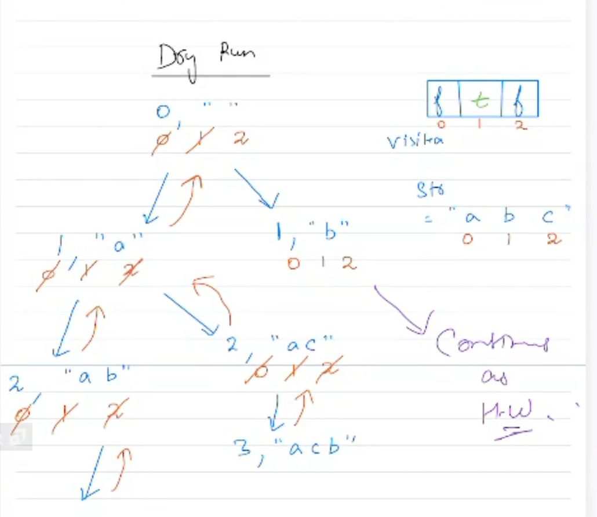
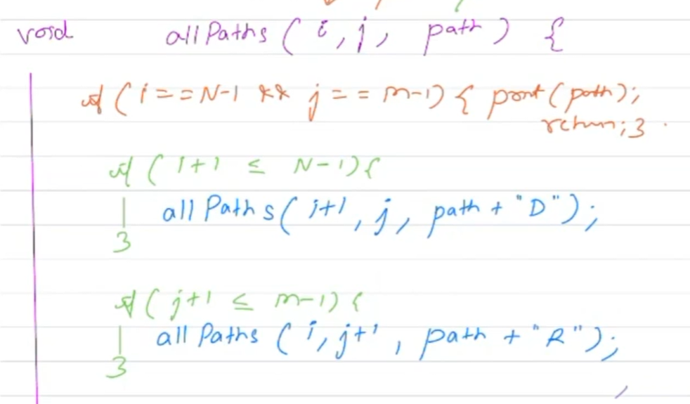
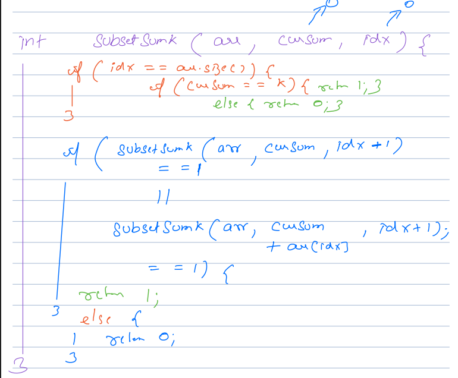

------------------Backtracking lecture notes starts------------
Lets create notes of backtarcking - We have given tree 

Q. What is backtracking

let say tree 

         A

   N       I

T   D      M   R

How to search AIM? - travese the tree - in order - and see if we are going in right finding A --> then I ---> then M

solution way - 

Use recursion depth first recursion (DFS - is ANT != AIM, check next ...)

Approach 2 - I move from root (A) to next root and as there was next char was not I , return from there directly - this is not do traverse as soon as value not match - this is backtracking (think like trying to find treasure - as you start and as you find in between also that this path is wrong - drictly skip that path and go with only best possible path that match the map to reach end) --> 
Backtracing = an algo tech of exploring all possibility using recussion and stopping when we hit a condition that confirm no need to go further - immediate go back and explore another path.

DFS is travese technique and backtracking is optimizing solution by going back as soon as possible we see solution is not possible with a particular travese

what is BFS vs DFS - which one useful where?

Qus: Given an int A pairs of paranthesis - write a function to genrate all combinantions of wel formed parenthees of length 2*A

only move to right direction

regression --> if total = 2*A and open breaket == closing breaket - append to result.
if(openbreaket < A){ // because we only use A open breaket when total breaket 2A
    solve(str+'(', A, op+1, clo);
}
if(closing_Break < openbrek){
    solve(str+')', A, op, clo+1);
}
T.C. -> every state making 2 calls - worst case 2 diff call from each stage -->  0         1
        0       0    2
     0     0  0   0  4
                    .... 2^n (till n stage)
                    T.C - O(2^n), S.C - O(n)

Qus: Subset - arr[] {7,9,4,3,8} --> (subset part of an array -> {}, {7}, {3,7}  --> set have no sequence - subset also have no sequence it means which values it have - every element have choice to be part of subset or not to be part of subset - any element not needed to be in sequence (different type of question - or that is different thing that should be in sequence.))
if we have {10,20,30} -> start from empty - then each level choose one item let say 10 -> it have two choice either part of subset or not - do same with other 2 at the end we have all possible subsets -->
                    {}
        {}          {30}
    {}  {20}        {20}
{}                  {20,30}
    {10} {10}       {10}
                    {10,30}
         {10, 20}   {10,20}
                    {10,20,30}
As we saw here - we have to explore all different possiblities - this is problem of backtracking - now to trim some state or not that we will think while optimize

arr = [10,20,30] -> code written tricky
curr = {} // current stage of arr ->eg. when not select 10 {} when select 10 {10}
for each stage not select - when we do not select -> subset(arr, idx+1, curr) //Line 1 == 1
for each stage selcting - 
curr.add(arr[idx]); //Line 2 == 2
subset(arr, idx+1, curr) //Line 3 == 3
curr.remove(arr[idx])  //Line 4 == 4  // this is tricky part because we have to keep this state so when we retun to previous state - that again go to next tree it should not have this value

--> https://www.scaler.com/academy/mentee-dashboard/class/313284/session?joinSession=1 -->1:13

Best way to dry run so I can imagine also and be on right track -->
        (arr[],0,{})
    1       (index of main array)
  1,2,3,4 (number of line executed)

2
1,2,3,4

3 --> add to ans, retun

Qus: Permuatation - Given a string S. print all the permutaion of the gven strnig 
ex: abc given => abc, acb, ... => We learn as here we want to print all permuations - means 3! - so best optimze solution will have 3! iteration minimum --> Here we have to explore all possible  --> How to solve this using backtracking - here
Unique that each stage different set of option for choosing
                      _ _ _
                a_ _  b_ _  c_ _        (each stage have choice to select anyone and skip others - here selection 3)
        ab_ ac_   ba_ bc_   ca_ cb_  (in this stage selection options only 2)
    abc acb     bac bca     cab cba

as we move a head I have to keep track what all char I already visited - means as we visited a - mark it as visited and the explore possiibilites of b and c only - so we need visited array
arrAns = [];
p(abc, 0, '', [0,0,0])
void permuatations(str, idx, ans, visited){
    if(ans.length == 3){
        arrAns.add(ans);
        return;
    }
    for(int i = 0; i<v.length; i++){
        if(v[i] == 0){
            <!-- "ans = ans+str[i];" -->
            visited[i] = 1;
            p(str, idx+1, ans+str[i], visited);
            visited[i] = 0;
            <!-- // Doubt: if I used "ans = ans+str[i];" will I have to strip str[i] from ans to get its previous state? Q2. why it self it getting its previous state after recussive call in current code flow -->
        }}}

I was not able to understand what need of idx --> after seeing the class video - I understand that he is using idx so he know for which index we are using function call to occupy
when imagine go in depth of one level till end and then come back up (but also to create soltion you have to think how this work in across different branch also...)
then we will know that idx how to use and update during moving 

I need a copy and pen for imagine and understand how these call happening and how looping etc running - best way to keep track of index, ans -> and each line how three loop is running etc.. make map like attached image

"D:\Claude\Shubham\Scaler\Pdfs\DSA__Backtracking_2.pdf"
-> Here three questions 
-> steps (1, 2) and all maze (move either D 0r R)

when we want to print in lexographical order exhaust lowest things first (1 is steps qus, and D in maze question)
for steps - solution visulaize when we move from end to base, in maze we start from start and move down first - till reach boundary - then move rights..

Q3:

------------------Backtracking lecture notes Ends------------

